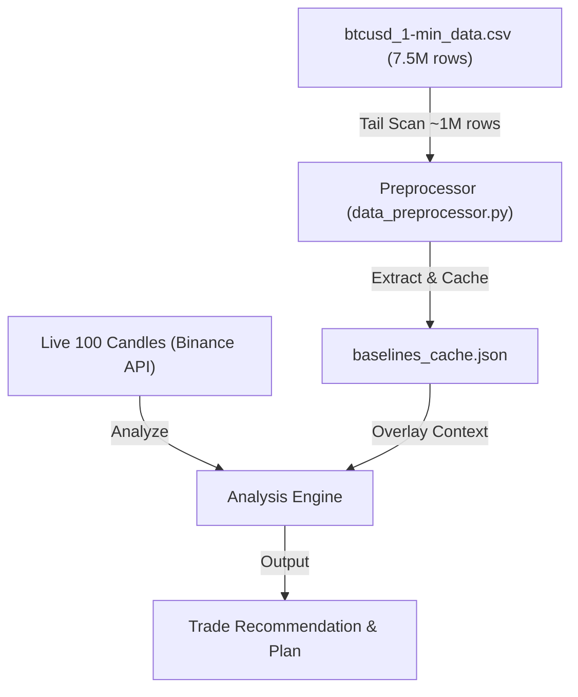

# Bitcoin Chart Analyzer — How It Works

This document explains how the **Bitcoin Chart Analyzer** processes live data, runs technical indicators, and integrates historical context from your 7.6-million-row CSV dataset.

---

## 1. Input Fields

The system accepts the standard **OHLCV** inputs (either populated automatically via the Binance API, pasted from a spreadsheet, or typed in manually):

*   **Open**: The price at which the candle period began.
*   **High**: The highest price reached during the candle period.
*   **Low**: The lowest price reached during the candle period.
*   **Close**: The price at which the candle period ended.
*   **Volume**: The total amount of Bitcoin traded during the candle period.
*   *Timestamp (optional)*: Used to keep candles chronologically ordered (oldest at the top, latest/current at the bottom).

---

## 2. Live Data Analysis Flow

When you submit the 100 live candles, the **Analysis Engine (`analysis_engine.py`)** computes **8 technical indicators** purely on the live data:

1.  **MACD (12, 26, 9)**: Evaluates short-term momentum and moving average crossovers.
2.  **RSI (14)**: Measures velocity of price changes to identify overbought (>70) or oversold (<30) zones.
3.  **Stochastic Oscillator (14, 3, 3)**: Compares closing price to the high-low range to identify potential reversals.
4.  **Bollinger Bands (20, 2)**: Detects volatility bands and breakout squeeze conditions.
5.  **EMA Crossover (9/21 + 50/200)**: Identifies short-term and medium-term trend direction.
6.  **ADX (14)**: Measures overall trend strength (trending vs. ranging market).
7.  **Ichimoku Cloud (9/26/52)**: Evaluates price location relative to cloud boundaries (Senkou Span A/B) and Tenkan/Kijun line crossings.
8.  **VWAP (Volume Weighted Average Price)**: Uses volume weighting to check if the current price represents a premium or discount relative to the session average.

### Score Generation
Each indicator produces a signal score from **-1.0 (strong sell)** to **+1.0 (strong buy)**. These are combined using a weighted average to calculate the **Composite Score**:
*   **Composite > +0.15** $\rightarrow$ **LONG** signal
*   **Composite < -0.15** $\rightarrow$ **SHORT** signal
*   **In-between** $\rightarrow$ **HOLD** signal

---

## 3. Comparison with the 7.5-Million-Row CSV Dataset

Scanning the entire 7.5-million-row CSV (~384MB) on every request would freeze the server. Instead, the **Preprocessor (`data_preprocessor.py`)** extracts statistical baselines on startup (and caches them to `baselines_cache.json` for instant subsequent loads):

Once the live 100-candle signal is generated, the system overlays it with the pre-computed historical context:

### A. Support/Resistance (S/R) Level Matching
*   **How S/R is found**: The preprocessor groups the last ~1 million closes from the CSV into 200 density bins to identify the top price clusters (zones where the price spent the most time).
*   **How it compares**: The system checks where the current live price sits relative to these historical levels. If the live price is near a cluster, it flags it as a historical support (bounce likely) or resistance (rejection likely) area.

### B. Price Regime Context
*   **How Regimes are found**: The preprocessor breaks the CSV data down into brackets (e.g., $30k–$60k, $60k–$100k) and computes average volume and standard deviation (volatility) for each regime.
*   **How it compares**: The current live price is matched to its historical regime, allowing the engine to contextualize whether the current live volume and price moves are standard or highly anomalous.

### C. Macro Trend Alignment
*   **How Trend is found**: The preprocessor calculates the long-term trend (50 SMA vs 200 SMA) on the tail of the CSV dataset.
*   **How it compares**: The system checks if your short-term live indicators are aligned with the long-term trend, helping you avoid trading against macro market directions.
