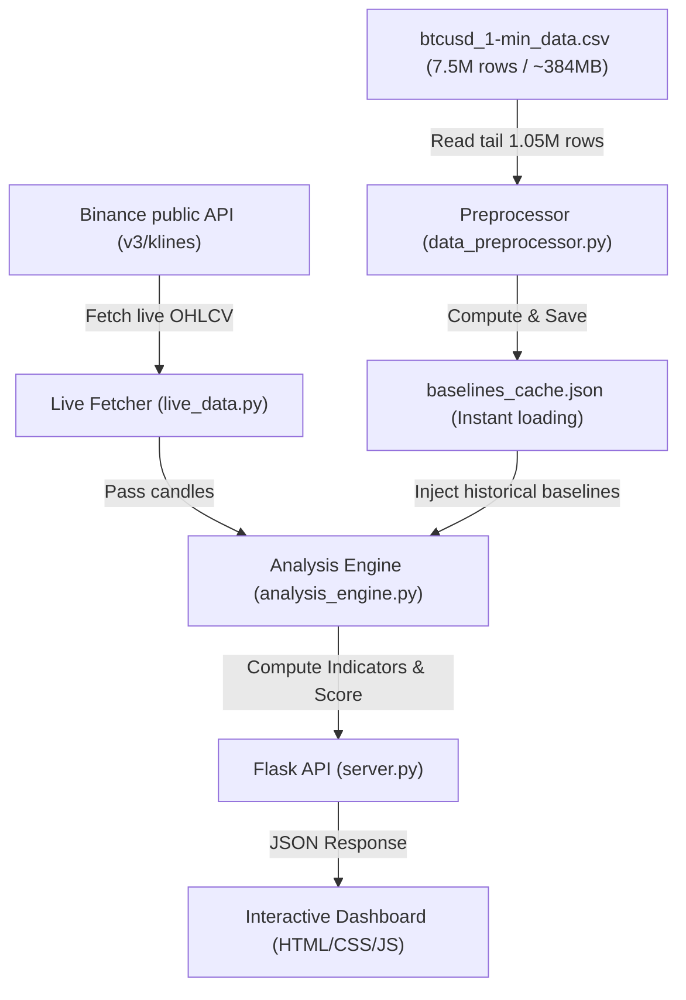

# SignalX (Bitcoin Chart Analyzer) 📈🤖

An advanced, real-time Python and Flask-based application that combines live technical analysis of Bitcoin (BTC) charts with historical context derived from a **7.5-million-row historical dataset**. 

The system leverages **8 weighted technical indicators** to generate composite trade signals (`LONG`, `SHORT`, `HOLD`) and overlays statistical baselines, price regimes, and support/resistance zones extracted from years of minute-by-minute BTC/USD data.

---

## 🏗️ System Architecture & Data Flow

The application splits computational heavy-lifting between **startup-time pre-processing** (on the historical CSV) and **run-time dynamic analysis** (on live Binance data):



---

## 📊 The Dataset & Preprocessing

The historical dataset, [`btcusd_1-min_data.csv`](file:///c:/Users/gy897/OneDrive/Desktop/Bitcoin%20tracker/btcusd_1-min_data.csv), is a substantial file containing **~7.5 million rows (~384MB)** of 1-minute historical data with the following fields:
*   **Timestamp**: Unix epoch timestamp (seconds).
*   **Open / High / Low / Close**: The standard OHLC asset pricing for the 1-minute interval.
*   **Volume**: The total amount of Bitcoin traded in that minute.

### ⚡ Efficient Tail Processing & Caching
Parsing 7.5 million rows on every server start or API request would be highly inefficient. To maintain a fast startup and small footprint, [`data_preprocessor.py`](file:///c:/Users/gy897/OneDrive/Desktop/Bitcoin%20tracker/data_preprocessor.py) implements:
1.  **Tail Loading**: Reads only the last **1,050,000 lines (~2 years of 1-minute data)** from the end of the file, allowing the application to establish a representative, modern baseline.
2.  **Data Cleaning**: Discards stale/empty candles (rows where volume is zero and Open/High/Low/Close values are identical) and handles NaNs.
3.  **JSON Caching**: Saves computed baselines to [`baselines_cache.json`](file:///c:/Users/gy897/OneDrive/Desktop/Bitcoin%20tracker/baselines_cache.json). If this file exists, it loads instantly (sub-second) upon server boot. Re-generation takes about 1-3 minutes if the cache is missing or forced.

---

## ⚙️ Statistical Baselines Explained

The preprocessor computes four key statistical profiles to contextualize live market movements:

### 1. Support & Resistance (S/R) Level Matching
Instead of using basic pivot points, the system identifies real structural boundaries:
*   **Price Density Clustering**: Closes are grouped into 200 density bins.
*   **Peak Detection**: Local maxima peaks with counts above the 75th percentile are registered as key price levels.
*   **Live Comparison**: The system checks where the current price sits relative to these clusters to flag nearby support (reversal buy zone) or resistance (selling ceiling).

### 2. Price Regime Statistics
Bitcoin behaves differently in a bull run compared to a bear market. The preprocessor segment stats across five price regimes:
*   `below_10k`, `10k_30k`, `30k_60k`, `60k_100k`, and `above_100k`
*   For each regime, it calculates: **candle counts, average volume, standard deviation of returns (volatility), and average candle price range percentage**.
*   This is used to determine if current volume/volatility is anomalous for the active price level.

### 3. Volatility Profiling
*   Calculates 1-minute returns ($R_t = \frac{C_t - C_{t-1}}{C_{t-1}}$) and computes rolling 60-candle (1 hour) standard deviations.
*   Maps these standard deviations into percentiles (`p10` to `p95`).
*   Helps the analysis engine identify whether current market conditions represent extreme volatility or typical quiet ranging.

### 4. Macro Trend Bias
*   Calculates the **50-period SMA** and **200-period SMA** on the tail of the historical dataset.
*   Sets a `trend_bias` (`bullish` or `bearish`), signaling to the trader whether short-term signals align with the macro momentum.

---

## 📈 Technical Analysis Engine (8 Indicators)

The engine ([`analysis_engine.py`](file:///c:/Users/gy897/OneDrive/Desktop/Bitcoin%20tracker/analysis_engine.py)) processes the candle array (typically 100 live candles) and returns a signal score between **`-1.0` (Strong Sell)** and **`+1.0` (Strong Buy)** for each indicator.

| Indicator | Default Parameters | Logic & Scoring Method | Weight |
| :--- | :--- | :--- | :--- |
| **MACD** | 12, 26, 9 | Crossover direction ($\pm 0.4$) + Histogram momentum increase/decrease ($\pm 0.3$) + Magnitude boost relative to price (up to $\pm 0.3$). | **15%** |
| **RSI** | 14 | Extreme zones: $<20$ ($+0.9$), $<30$ ($+0.6$), $<40$ ($+0.2$), $>80$ ($-0.9$), $>70$ ($-0.6$), $>60$ ($-0.2$). | **15%** |
| **Stochastic** | 14, 3, 3 | Zone scoring (under 20 is $+0.4$, over 80 is $-0.4$) combined with %K vs %D crossover ($\pm 0.5$). | **10%** |
| **Bollinger Bands** | 20, 2 | Evaluates position relative to upper/lower bands. Detects **Band Squeeze** ($<2\%$ bandwidth) indicating imminent breakout. | **10%** |
| **EMA Crossover** | 9/21, 50/200 | Fast crossover (9/21) contributes $\pm 0.3$. Slow crossover (50/200) Golden/Death cross contributes $\pm 0.4$. | **15%** |
| **ADX** | 14 | Trend strength: $>40$ scales trend direction signal by $1.0$; $>25$ scales by $0.7$; $>20$ scales by $0.3$; $<20$ represents ranging market ($0.0$). | **15%** |
| **Ichimoku Cloud** | 9, 26, 52 | Price position vs. cloud top/bottom ($\pm 0.4$) + Tenkan/Kijun cross ($\pm 0.3$) + Future cloud color Span A vs Span B ($\pm 0.2$). | **10%** |
| **VWAP** | Cumulative | Volume-weighted typical price vs Close. Price $>1.5\%$ above/below flags overextension, price $\pm 0.3\%$ flags trend bias. | **10%** |

### 🎯 Composite Score & Trade Signal Translation
A weighted average of the active indicators calculates the **Composite Score**:
$$\text{Composite Score} = \frac{\sum (\text{Indicator Score} \times \text{Weight})}{\sum \text{Active Weights}}$$

*   **Composite Score $> +0.15$** $\rightarrow$ **`LONG`**
*   **Composite Score $< -0.15$** $\rightarrow$ **`SHORT`**
*   **In-between $[-0.15, +0.15]$** $\rightarrow$ **`HOLD`**

### 🛡️ ATR-Based Dynamic Trade Planning
If a directional bias (`LONG` / `SHORT`) is determined, the engine uses the **Average True Range (ATR)** from the ADX calculation to generate a trade plan:
*   **Entry Zone**: Current market close price.
*   **Stop Loss**: $1.5 \times \text{ATR}$ away from entry.
*   **Take Profit 1**: $2.0 \times \text{ATR}$ away from entry.
*   **Take Profit 2**: $3.0 \times \text{ATR}$ away from entry.
*   **Risk-to-Reward Ratio**: Strictly targeted between 1:2 and 1:3.

---

## 🔌 API Endpoints

The Flask server ([`server.py`](file:///c:/Users/gy897/OneDrive/Desktop/Bitcoin%20tracker/server.py)) exposes the following REST API endpoints:

*   `GET /` — Serves the frontend application dashboard.
*   `GET /api/health` — Returns application status, server information, and verification of whether the historical baselines cache is loaded.
*   `GET /api/baselines` — Returns the pre-computed historical statistical baselines as JSON.
*   `GET /api/fetch-live` — Fetch live OHLCV candles directly from Binance. Accepts optional `timeframe` (default: `5m`) and `limit` (default: `100`, max `1000`) query parameters.
*   `GET /api/fetch-and-analyze` — Fetches live data from Binance and runs the full analysis engine in a single API call.
*   `POST /api/analyze` — Analyzes custom-provided candle data. Expects a JSON payload:
    ```json
    {
      "candles": [
        {"open": 63000, "high": 63100, "low": 62900, "close": 63050, "volume": 1.5},
        ...
      ],
      "timeframe": "5m"
    }
    ```

---

## 🚀 Installation & Quick Start

Ensure you have Python 3.9+ installed on your machine.

### 1. Set Up Environment & Install Dependencies
It is highly recommended to isolate your project using a virtual environment:
```powershell
# Create virtual environment
python -m venv venv

# Activate virtual environment
.\venv\Scripts\activate      # Windows (CMD/PowerShell)
# source venv/bin/activate   # macOS/Linux

# Install dependencies
pip install -r requirements.txt
```

### 2. Run the Application
Start the Flask development server:
```powershell
python server.py
```
Upon startup, the preprocessor will search for [`baselines_cache.json`](file:///c:/Users/gy897/OneDrive/Desktop/Bitcoin%20tracker/baselines_cache.json). If it is not found, the server will take 1-3 minutes to load [`btcusd_1-min_data.csv`](file:///c:/Users/gy897/OneDrive/Desktop/Bitcoin%20tracker/btcusd_1-min_data.csv) and compute the baselines cache before launching.

Once started, navigate to `http://localhost:5000` to interact with the chart analyzer dashboard.
